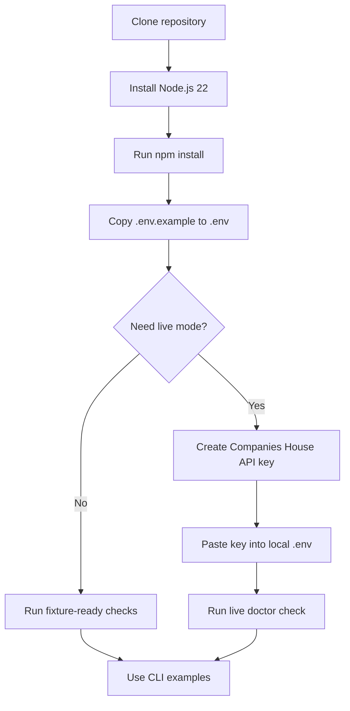
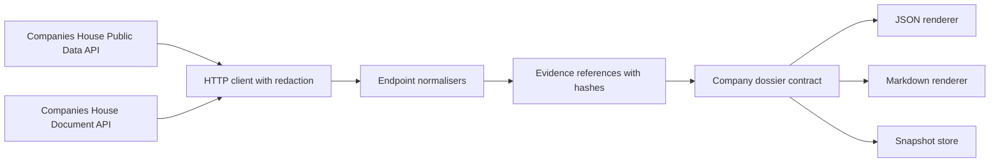
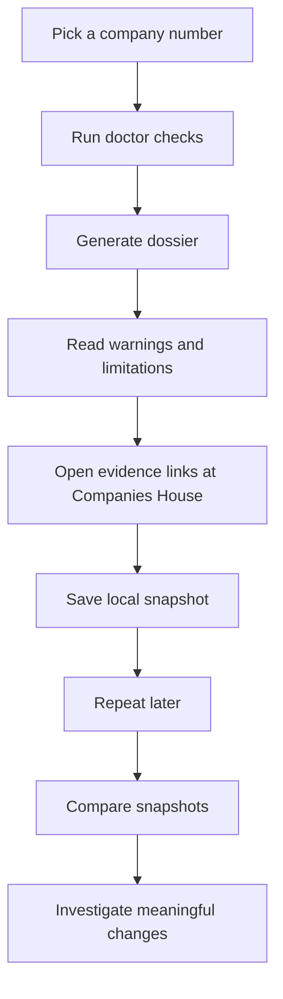

# UK Company Dossier

Build reproducible, evidence-linked UK company dossiers from Companies House public-register data.

This repository is designed for two audiences:

- non-technical users who want a clear, repeatable company-review workflow; and
- technical users who want a typed CLI/MCP foundation for evidence-backed automation.

The project is source-available under [PolyForm Noncommercial License 1.0.0](LICENSE). Non-commercial learning, research, and community experimentation are welcome. Commercial use requires explicit written permission; see [COMMERCIAL.md](COMMERCIAL.md) and the commercial licensing notes below.

## What it does

`uk-company-dossier` collects public Companies House information, normalises it into a stable evidence contract, and renders the result as JSON or Markdown. The current dossier can include:

- company profile;
- officers;
- persons with significant control;
- charges;
- insolvency status;
- filing history;
- filing document metadata and safe document retrieval;
- local snapshots and snapshot comparison.

Every dossier fact is linked back to upstream evidence with retrieval time, source URI, and payload hash metadata so that users can re-check the source later.

## Setup flow



### 1. Install dependencies

```bash
npm install
npm run build
```

The project targets Node.js 22. The repo includes an `.nvmrc` for version managers.

### 2. Create your local environment file

Copy the example file:

```bash
cp .env.example .env
```

Then edit `.env` locally. Never commit `.env`.

The expected variables are:

- `COMPANIES_HOUSE_API_KEY` for your own Companies House API key;
- `COMPANIES_HOUSE_API_BASE_URL`, defaulting to the public data API;
- `COMPANIES_HOUSE_DOCUMENT_API_BASE_URL`, defaulting to the document API.

### 3. Get your own Companies House API key

Companies House API keys are free to create, but each user must use their own key.

1. Open the [Companies House Developer Hub](https://developer.company-information.service.gov.uk/).
2. Follow [Get started](https://developer.company-information.service.gov.uk/get-started).
3. Register or sign in.
4. Follow [How to create an application](https://developer.company-information.service.gov.uk/how-to-create-an-application).
5. Create an API client/key for local development.
6. Read the [authentication guide](https://developer.company-information.service.gov.uk/authentication): Companies House API key authentication uses HTTP Basic authentication with the key as the username and a blank password.
7. Store the key only in your local `.env`.

Companies House also publishes [developer guidelines](https://developer.company-information.service.gov.uk/developer-guidelines) and [API testing guidance](https://developer.company-information.service.gov.uk/api-testing). Follow those guidelines, especially around keeping credentials out of source code.

## Fixture mode and live mode

This repository separates fixture mode from live mode on purpose.

- fixture mode: runs local tests and examples without a live API key. This is the default for contributors and CI.
- live mode: calls Companies House with your own API key. Use this when you need current public-register data.

Run local readiness checks:

```bash
npm run doctor
```

Run live readiness checks after configuring `.env`:

```bash
npm run cli -- doctor --live
```

## CLI examples

Build a JSON dossier:

```bash
mkdir -p out
npm run cli -- 00445790 --format json --output out/tesco-dossier.json
```

Build a Markdown dossier:

```bash
mkdir -p out
npm run cli -- 00445790 --format markdown --output out/tesco-dossier.md
```

List filings with filters:

```bash
npm run cli -- filings 00445790 --from 2024-01-01 --to 2026-12-31
```

Save and compare snapshots:

```bash
npm run cli -- snapshot save 00445790 --snapshot-dir .snapshots
npm run cli -- snapshot list 00445790 --snapshot-dir .snapshots
npm run cli -- snapshot compare .snapshots/before.json .snapshots/after.json
```

Retrieve filing document metadata or a document file when you have a document identifier from filing history:

```bash
npm run cli -- document DOCUMENT_ID
npm run cli -- document DOCUMENT_ID --output-dir out/documents
```

Create a reproducible random-selection manifest for public examples:

```bash
npm run examples:select
```

## Evidence flow



The implementation is built around official Companies House sources:

- [Companies House API specifications](https://developer-specs.company-information.service.gov.uk/)
- [Companies House Public Data API reference](https://developer-specs.company-information.service.gov.uk/companies-house-public-data-api/reference)
- [Companies House Document API reference](https://developer-specs.company-information.service.gov.uk/document-api/reference)
- [Document metadata endpoint](https://developer-specs.company-information.service.gov.uk/document-api/reference/document-metadata)
- [Fetch a document endpoint](https://developer-specs.company-information.service.gov.uk/document-api/reference/document-location/fetch-a-document)
- [Companies House data-products guidance](https://www.gov.uk/guidance/companies-house-data-products)

See [docs/companies-house-sources.md](docs/companies-house-sources.md) for the source map used by the repo.

## MCP usage

The repo includes an MCP server so coding agents can request company dossiers, filing lists, filing documents, and snapshot operations through tools.

Build first:

```bash
npm run build
```

Then configure your agent using one of the templates:

- [Claude Desktop example](docs/mcp/claude.json.example)
- [Codex TOML example](docs/mcp/codex.toml.example)

The templates contain placeholders only. Replace `${UK_COMPANY_DOSSIER_REPOSITORY}` with your local checkout path and provide `${COMPANIES_HOUSE_API_KEY}` through your own secure environment mechanism.

## Best-value workflow



For non-technical users, start with [docs/use-cases/non-technical-company-review.md](docs/use-cases/non-technical-company-review.md). For technical users, start with [docs/use-cases/technical-evidence-integration.md](docs/use-cases/technical-evidence-integration.md).

## Example company selection

Demonstration companies were selected programmatically by this repository's documented random-company picker from predeclared Companies House eligibility pools. The author did not choose or rank the selected companies. Inclusion does not imply endorsement, criticism, concern, affiliation, or preference. Public-register information is shown solely to demonstrate software behaviour, may change, and must be verified at Companies House before use.

The random-selection policy lives in [examples/random-selection/README.md](examples/random-selection/README.md). Example fixture guidance lives in [examples/fixtures/README.md](examples/fixtures/README.md).

## Data attribution

The software queries Companies House public-register services, but this repository does not own Companies House data. Generated outputs should preserve provider attribution, source URI, retrieval time, and the non-affiliation statement embedded in the dossier contract.

Before redistributing any generated data, review [DATA-LICENSING.md](DATA-LICENSING.md), the [Companies House data-products guidance](https://www.gov.uk/guidance/companies-house-data-products), and any terms that apply to the specific data or document you are using.

## Limitations

- Public-register data can change after retrieval.
- Some endpoints can return partial data, unavailable sections, or rate-limit responses.
- This tool is not legal, accounting, audit, credit, risk, compliance, investment, or due-diligence advice.
- A generated dossier is a software artifact, not a substitute for checking Companies House directly.
- Filing documents may contain personal data or third-party material. Handle them carefully.

## Security

- Never commit `.env`.
- Never paste API keys into issues, examples, screenshots, or generated fixtures.
- Treat document downloads as untrusted external content.
- Keep generated outputs under review before publishing them.
- Run `npm run docs:links`, `npm run docs:mermaid`, and the release verification script before publishing changes.

## Commercial licensing

The public licence is non-commercial. Commercial use requires a separate written licence before use in a business, paid product, paid client service, internal for-profit workflow, hosted service, paid support arrangement, or commercial consultancy workflow.

Open a public enquiry with the [commercial licensing issue template](https://github.com/Paritoshdagar/uk-company-dossier/issues/new?template=commercial-licensing.yml) only for initial contact. A separate signed written licence is required before any commercial use.

## Development checks

```bash
npm run docs:links
npm run docs:mermaid
npm test
npm run typecheck
npm run lint
npm run verify:release
```

The docs checks are deterministic and do not call the internet.
